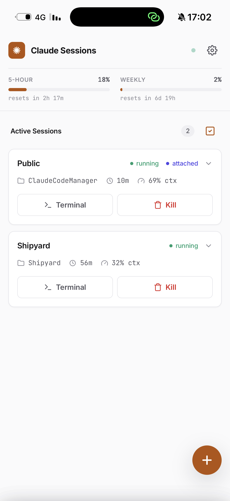
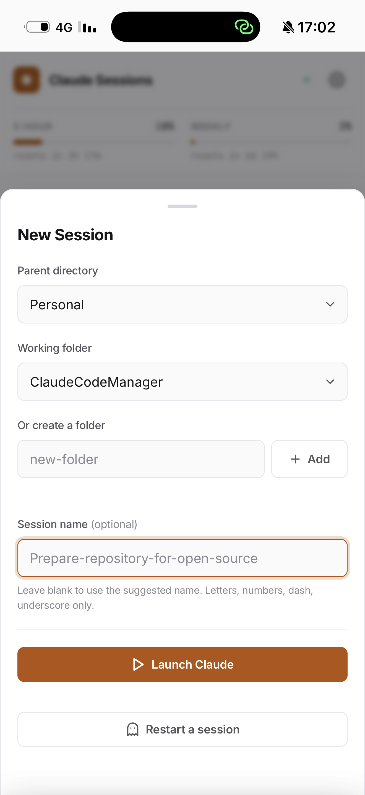
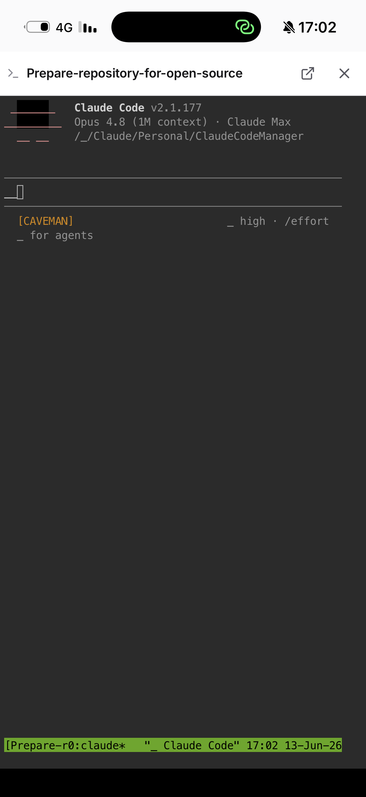

# Agent Session Manager

> Unofficial, community project — not affiliated with, endorsed by, or sponsored
> by Anthropic. "Claude" and "Claude Code" are trademarks of Anthropic, used
> here only to describe compatibility.

Mobile-friendly web UI to manage [Claude Code](https://claude.com/claude-code)
sessions running inside `tmux`. List, create, kill, and open an in-browser
terminal for each session — from your phone or any browser. Runs **natively**
(no Docker) and can install itself as an auto-starting service.

  

<!-- Screenshots: drop PNGs into docs/screenshots/ (see that folder's README). -->
<p align="center">
  
  
  
</p>

> [!WARNING]
> **The in-browser terminal is an unauthenticated shell into the host — read [Security](#security) before changing the bind address.**
> By default the server and ttyd bind **loopback only** (`127.0.0.1`), and remote
> access is meant to go over **Tailscale** (set up automatically by the
> installer) or an SSH tunnel — never raw on the LAN. Setting `BIND_ADDR=0.0.0.0`
> re-exposes every interface with no auth; only do that behind a VPN or a
> reverse proxy that adds authentication.

## Features
- **List sessions** — name, working folder, age, running/idle, attached
- **Create a session** — pick a parent → folder → name; launches
  `claude --permission-mode auto --remote-control <name>`. Name optional
  (auto-derived from Claude's session title, else the folder name).
- **Kill sessions** — single or bulk multiselect, with confirmation
- **In-browser terminal** — full `tmux` attach per session via
  [ttyd](https://github.com/tsl0922/ttyd), patched for one-finger touch scroll
- **Wake offline sessions** — after a host/service restart wipes tmux, recreate
  a session from Claude's own per-cwd history and `--continue` the latest convo
- **Parent folders** — configure a list of directories whose subdirs are
  session targets, via a built-in host directory browser (settings sheet)
- **Create subfolders** on the fly under any configured parent
- **Usage strip** — 5-hour / 7-day Claude usage; per-session context-window meter
- **Auto-refresh every 5s** — re-renders only on real changes (no flicker)

## Why native (not Docker)
Sessions are **real host tmux sessions**, so `claude` runs on the host using the
host's existing auth (macOS Keychain / Linux `~/.claude`). No re-login, no
container isolation. Docker was dropped for exactly this reason — on macOS the
container can't reach the host tmux socket or Keychain.

## Requirements
Install once (all must be on `PATH`):

| Tool | macOS | Linux (Debian/OMV) |
|------|-------|--------------------|
| node (≥18) | `brew install node` | `apt install nodejs npm` |
| tmux | `brew install tmux` | `apt install tmux` |
| ttyd | `brew install ttyd` | [static binary](https://github.com/tsl0922/ttyd/releases) |
| claude | `npm i -g @anthropic-ai/claude-code` | same |

Claude must be authenticated on the host: run `claude` once and log in.

## Install & run

```bash
git clone https://github.com/GalCo3/agent-session-manager.git
cd agent-session-manager/backend && npm install && cd ..
```

### As a service (recommended)
Auto-detects macOS (launchd) or Linux (systemd):

```bash
./install-service.sh
```

- macOS → per-user LaunchAgent `com.claude.sessions`, logs in `./logs/`
- Linux → system service `claude-sessions`, logs via `journalctl -u claude-sessions -f`
- Binds **loopback** (`127.0.0.1`) and, if Tailscale is installed and logged in,
  runs `tailscale serve` so you can reach the UI from your tailnet devices at
  `http://<your-tailnet-host>:3000`. No Tailscale? It stays localhost-only and
  prints how to add it.

Hardening flags (see [Security](#security)):

```bash
LIMITED_USER=1 ./install-service.sh   # Linux: run the service as a keyless claude-web user
TAILSCALE=0    ./install-service.sh   # skip tailnet setup (localhost / SSH-tunnel only)
BIND_ADDR=0.0.0.0 ./install-service.sh # ⚠ re-expose on the LAN — only behind a VPN/auth proxy
```

Uninstall: `./install-service.sh uninstall` (also removes the tailscale serve forwards).

### Manually (foreground, for dev)
```bash
./run.sh
```
Starts ttyd + the Node server on `127.0.0.1`; Ctrl-C tears both down.

Open **http://localhost:3000** on the host. To reach it from your phone, use
Tailscale or an SSH tunnel — see [Security](#security); it is **not** on the LAN
by default. On first run the parent-folders list is **empty**: open settings
(gear icon) and add a parent directory to start creating sessions.

## Security
This app is a remote terminal into your host. The terminal has **no built-in
auth** — anyone who can reach it can type into a live `claude` and, by exiting
it, get a shell. Defense is layered so no single slip is fatal:

**Layer A — loopback bind + Tailscale (network).** The API (`3000`) and ttyd
(`7681`) bind `127.0.0.1` only (`BIND_ADDR`), so the LAN/internet can't reach
them. The installer runs `tailscale serve` to forward both ports over your
tailnet (WireGuard-encrypted, your devices only) — reach the UI at
`http://<your-tailnet-host>:3000`. This is what closes the "anyone on the same
Wi-Fi gets a shell" hole. Alternatives: an SSH tunnel
(`ssh -L 3000:localhost:3000 -L 7681:localhost:7681 host`) or a reverse proxy
that adds auth. `BIND_ADDR=0.0.0.0` defeats this layer — don't, unless something
else is gating access.

**Layer C — no shell behind claude (escape).** Sessions launch `claude` as the
tmux window's command, not typed into a login shell. Exiting claude
(Ctrl-C / Ctrl-D) kills the pane and destroys the session instead of dropping
the attached terminal to a host shell with your ssh keys and sudo. Always on.

**Layer B — keyless service user (privilege, opt-in).** `LIMITED_USER=1` runs
the Linux service as a dedicated `claude-web` user with no ssh keys and no
sudo, so even a future escape lands as a powerless user — not as you. The
installer creates the user and prints the one-time follow-ups (log claude in as
that user, grant it access to your working-folder parents). It starts with its
own home/config, so re-add your parent folders in the UI. Linux/systemd only.

**Other notes.**
- **The directory browser roams the whole host filesystem** by design, so the
  UI can pick parent folders. Session/folder *names* are sanitized to
  `[A-Za-z0-9_-]` before being interpolated into tmux/shell commands, but the
  browse endpoint enumerates arbitrary directory names to whoever is connected
  — another reason to keep access to your own devices.
- **No rate-limiting, CSRF protection, or login.** Do not expose `3000`/`7681`
  to the public internet. `tailscale funnel` (public) is explicitly *not* used.

Recommended baseline: defaults (loopback + Tailscale) for the network, plus
`LIMITED_USER=1` if the host holds credentials you care about. PRs that add auth
welcome.

## Configuration
Environment variables (defaults shown):

| Var | Default | Meaning |
|-----|---------|---------|
| `PORT` | `3000` | web UI + API port |
| `TTYD_PORT` | `7681` | ttyd terminal port |
| `BIND_ADDR` | `127.0.0.1` | address the API + ttyd listen on. Loopback by default; `0.0.0.0` re-exposes the LAN (see [Security](#security)) |
| `TAILSCALE` | `auto` | installer only: `auto`/`1` set up `tailscale serve` for both ports; `0` skips it |
| `LIMITED_USER` | `0` | installer only (Linux): `1` runs the service as a keyless `claude-web` user |
| `SERVICE_USER_NAME` | `claude-web` | installer only: name of the `LIMITED_USER` account |
| `DEV_ROOT` | `$HOME/StudioProjects` | only seeds the directory browser's default start dir (not the folder root) |
| `CONTEXT_LIMIT` | `200000` | model context window in tokens, for the per-session meter (set `1000000` for 1M-context) |
| `TMUX_SOCKET` | `/tmp/tmux-0` | shared tmux socket (`run.sh` only) |

Durable app state is a single file: the parent-folders list at
`~/.config/claude-sessions/config.json` (`{ "parents": [...] }`), written
atomically when you add/remove a parent in the UI.

## API
All names are sanitized to `[A-Za-z0-9_-]`; every folder/session endpoint
re-validates `parent` against the configured parent list.

| Method | Path | Body / query | Result |
|--------|------|--------------|--------|
| GET | `/api/sessions` | — | live sessions (name, cwd, created, attached, hasClaudeCode) |
| POST | `/api/sessions` | `{parent, folder, name?}` | create session + launch claude |
| DELETE | `/api/sessions/:name` | — | kill session |
| GET | `/api/sessions/:name/terminal` | — | `{url}` ttyd link |
| GET | `/api/sessions/offline` | — | woke-able sessions mined from Claude history |
| POST | `/api/sessions/:name/wake` | `{cwd}` | recreate session + `claude --continue` |
| GET | `/api/parents` | — | configured parent dirs |
| POST | `/api/parents` | `{path}` | add a parent dir |
| DELETE | `/api/parents` | `{path}` | remove a parent dir |
| GET | `/api/browse` | `?path=` | list subdirs (host directory browser) |
| GET | `/api/folders` | `?parent=` | subdirs of a parent |
| GET | `/api/folders/suggested-name` | `?parent=&folder=` | suggested session name |
| POST | `/api/folders` | `{parent, name}` | create subdir |
| GET | `/api/usage` | — | Claude 5h / 7d usage |

## Files
```
backend/server.js     Express REST API + static file server (all API logic)
backend/package.json  only dep: express
frontend/index.html   markup; loads the CSS + js/main.js (ES module)
frontend/css/         styles.css (warm amber/indigo dark theme, design tokens)
frontend/js/          vanilla ES modules — no framework, no bundler:
                        main.js      entry: init + shared overlay/key wiring
                        api.js       REST client
                        utils.js     $, esc, age, flash, icons
                        sessions.js  session list + poll loop
                        selection.js multiselect + bulk bar
                        create.js    new-session sheet + folders
                        dialog.js    kill confirm (single + bulk)
                        offline.js   wake-offline-sessions sheet
                        terminal.js  in-browser terminal modal
                        usage.js     usage strip + context meter
                        settings.js  parent-folders settings + directory browser
ttyd/                 patched ttyd UI (stock bundle + touch-scroll shim);
                        regenerate index.html with build-index.sh after upgrades
run.sh                start ttyd + node natively
install-service.sh    install/uninstall as launchd (macOS) or systemd (Linux)
```

The frontend has **no build step**: browsers load the ES modules directly and
Express serves `frontend/` statically. Edit a file, reload the browser. See
[CONTRIBUTING.md](CONTRIBUTING.md).

## Troubleshooting
- **Terminal opens then closes immediately** — ttyd needs `--url-arg` (set in `run.sh`).
- **Session shows `idle` while claude is running** — claude renames its process
  title to its version string; detection treats any non-shell pane as running.
- **Remote-control session not in the Claude app** — the host `claude` must be
  logged in (`claude` once interactively). Sessions launch with `--remote-control`.
- **Wrong session names / empty cwd** — some tmux builds (3.3a) mangle literal
  tabs in `-F` output; the server uses `|` as the field separator.
- **Parent-folders list empty / can't create sessions** — add a parent dir in
  the settings sheet first; the list starts empty.

## Disclaimer
This is an independent, unofficial tool. It is not affiliated with, endorsed by,
or sponsored by Anthropic. "Claude" and "Claude Code" are trademarks of
Anthropic, PBC — referenced here solely to describe what this software works
with (nominative use). You are responsible for complying with Anthropic's terms
when using Claude Code through this tool.

## License
[MIT](LICENSE) © GalCo3
